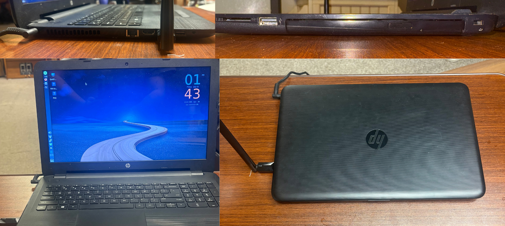
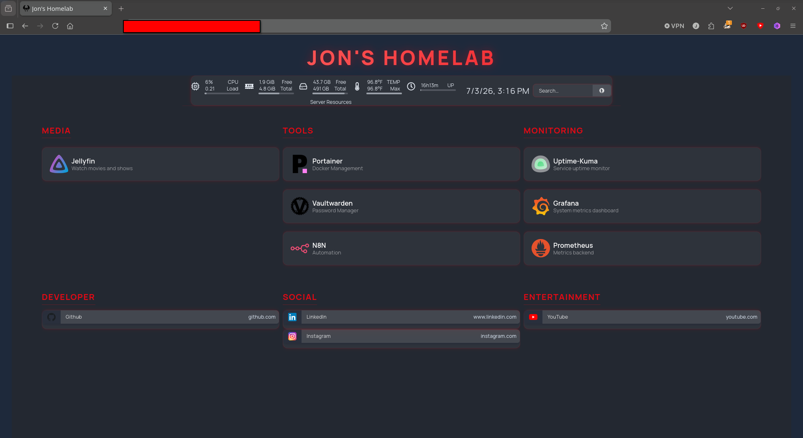
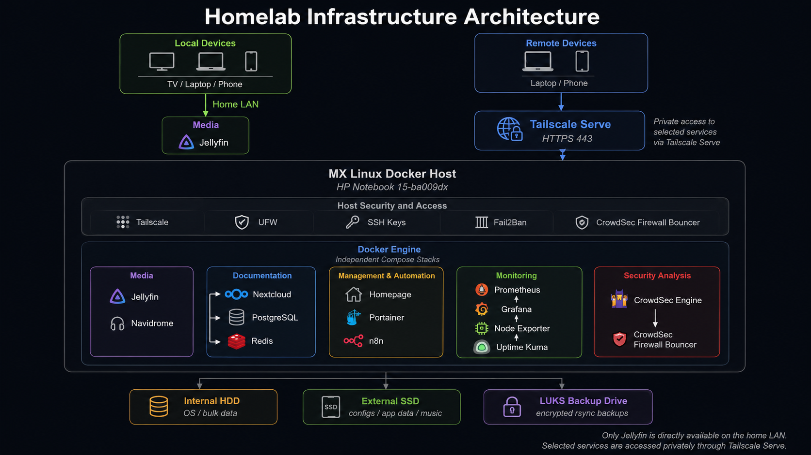

# Infrastructure & Security Lab

> A continuously evolving self-hosted infrastructure designed to develop practical experience in Linux administration, Docker, networking, automation, monitoring, and cybersecurity using consumer-grade hardware.

---

# Host Platform


The environment is hosted on an **HP Notebook 15-ba009dx (2016)** running **MX Linux 25 (Debian-based)**. Rather than relying on enterprise hardware, this project demonstrates that meaningful infrastructure and security experience can be developed using readily available consumer hardware while working within real-world resource constraints.

## Hardware Specifications

| Component | Specification |
|-----------|---------------|
| Host | HP Notebook 15-ba009dx |
| Operating System | MX Linux 25 (Debian-based) |
| Processor | AMD A6-7310 APU with Radeon R4 Graphics |
| Memory | 6 GB DDR3 |
| Storage | 500 GB Seagate HDD |
| Container Platform | Docker & Docker Compose |

---

# Homepage Dashboard


Homepage provides a centralized dashboard for managing and monitoring the homelab. It serves as the primary interface for accessing services, viewing system health, and organizing the infrastructure into logical groups.

---

# Architecture Overview


The infrastructure is organized into modular Docker Compose stacks, allowing services to remain independent, easier to maintain, and simple to expand over time.

Current deployments include Media Infrastructure and Monitoring, while Documentation and Security capabilities continue to evolve as the lab grows.

---

# Current Infrastructure

## Media Infrastructure

### Core Technologies

- Jellyfin
- Homepage
- Portainer
- Vaultwarden
- n8n

### Focus Areas

- Docker Compose
- Container networking
- Persistent storage
- Service management
- Dashboard customization
- Workflow automation

---

## Monitoring Infrastructure

### Core Technologies

- Grafana
- Prometheus
- Node Exporter
- Uptime Kuma

### Focus Areas

- Infrastructure monitoring
- Metrics collection
- Service availability monitoring
- System visualization
- Host performance analysis
- Docker host monitoring

---

# Current Learning Objectives

This project focuses on developing practical experience with:

- Linux system administration
- Docker and containerized infrastructure
- Infrastructure monitoring
- Network administration
- Secure remote access
- Infrastructure documentation
- Automation workflows
- Security hardening
- Self-hosted services

---

# Project Roadmap

## Documentation Stack

**Planned Technologies**

- Nextcloud
- Paperless-ngx
- OnlyOffice
- PostgreSQL
- Redis
- Apache Tika
- Gotenberg

**Focus Areas**

- Document management
- OCR workflows
- Collaboration
- File synchronization
- Database administration
- Self-hosted productivity

---

## Security Infrastructure

**Planned Technologies**

- Wazuh SIEM
- CrowdSec
- UFW
- Fail2Ban
- SSH Key Authentication
- Tailscale

**Focus Areas**

- Vulnerability management
- Host hardening
- Centralized logging
- Threat detection
- Secure remote administration
- Security monitoring

---

# Repository Structure

```text
.
├── README.md
├── docs
│   ├── media
│   ├── monitoring
│   ├── security
│   ├── networking
│   └── infrastructure
├── diagrams
├── images
└── docker
```

---

# Documentation

Project documentation is organized into focused guides that describe the deployment, configuration, troubleshooting, and lessons learned throughout the development of the homelab.

Planned documentation includes:

- Media Infrastructure
- Monitoring Stack
- Wazuh Deployment
- CVE Remediation
- Security Hardening
- Docker Architecture
- Documentation Platform
- Backup Strategy
- Homepage Customization
- Networking

---

# Design Philosophy

This project emphasizes learning through practical implementation rather than enterprise hardware.

By building and maintaining services on an aging consumer laptop, the focus remains on architecture, troubleshooting, documentation, automation, and continuous improvement instead of expensive infrastructure.

Every addition to the environment is documented, tested, and evaluated before becoming part of the long-term platform.

---

# Future Improvements

- SSD migration
- Memory upgrade
- Documentation platform deployment
- Expanded security monitoring
- Infrastructure automation
- Backup improvements
- Additional service integrations

---
