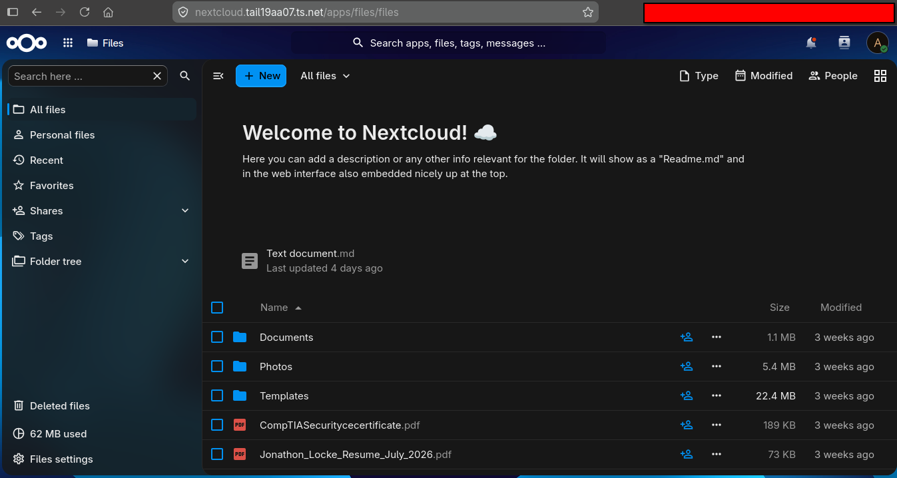

# Documentation and File Management Stack

## Overview

The documentation stack provides a private, self-hosted location for storing and editing personal and project files. It is built around Nextcloud and runs as an independent Docker Compose stack on the MX Linux homelab server.

The stack is intentionally lightweight. Instead of deploying a full browser-based office suite with a large memory requirement, the environment uses Nextcloud's built-in file management and text-editing capabilities for everyday documentation tasks.

## Primary Use Cases

The platform is used for:

- Storing resumes, cover letters, and other career documents
- Writing and editing Markdown or plain-text notes
- Keeping project documentation available across devices
- Organizing reference files and personal documents
- Maintaining a private alternative to relying entirely on third-party cloud storage
- Accessing documents remotely through the private Tailscale network

This workload does not require a full Microsoft Office replacement. The focus is reliable file access, lightweight editing, organization, and synchronization.

## Stack Components

| Service | Purpose |
|---|---|
| Nextcloud | Web interface, file storage, synchronization, sharing, and basic text editing |
| PostgreSQL | Dedicated relational database for Nextcloud application data |
| Redis | Caching and file-locking support |
| Apache | Web server included with the Nextcloud container image |
| Docker Compose | Defines and manages the application stack |

## Architecture

```text
Laptop / Phone / Other Tailnet Device
                 |
              Tailscale
                 |
        Nextcloud Web Interface
                 |
      +----------+----------+
      |                     |
  PostgreSQL              Redis
  Database          Cache / File Locking
                 |
       Persistent SSD Storage
```

The services are deployed together but maintain separate responsibilities. Nextcloud handles the user-facing application, PostgreSQL stores structured application data, and Redis improves responsiveness while supporting transactional file locking.

## Deployment Model

The documentation platform is maintained in its own Docker Compose directory rather than being added to the media or monitoring stack.

This modular design provides several operational benefits:

- The documentation stack can be started, stopped, or updated independently
- Troubleshooting is isolated from unrelated services
- Compose files and environment variables remain easier to organize
- Resource usage can be controlled on the low-power host
- A failure in one application group is less likely to interrupt every homelab service

Persistent application data is stored outside the containers so the stack can be recreated without losing files or configuration.

## Access Model

Nextcloud is intended to be accessed privately through Tailscale rather than exposed directly to the public Internet.

This approach provides:

- Encrypted connectivity between approved devices
- Remote access without opening general inbound router ports
- Consistent access from laptops and mobile devices
- Reduced exposure of the Nextcloud login page and administrative interface

Local access remains useful for devices on the home network, while Tailscale provides the preferred remote-access path.

## Nextcloud Dashbord


## Document Editing

For the current workload, Nextcloud's built-in text-editing features are sufficient for:

- Markdown documentation
- Plain-text notes
- README drafts
- Resume text and supporting notes
- Small configuration or reference files

A full OnlyOffice deployment was evaluated but deferred because its memory requirements were not appropriate for the available hardware. This was a deliberate resource-management decision: the existing Nextcloud tools meet the current requirements without consuming several additional gigabytes of memory.

## Storage and Persistence

The homelab uses persistent Docker storage so application data survives container recreation and image updates.

Important persistent data includes:

- Nextcloud configuration
- User files
- PostgreSQL database data
- Redis configuration where applicable
- Docker Compose and environment files

Application configuration is stored on the SSD-backed Docker configuration path to improve responsiveness compared with the server's older mechanical drive.

## Security Considerations

The documentation stack follows the broader homelab security model:

- Remote access is provided through Tailscale
- Administrative SSH access uses public-key authentication
- The host firewall follows a default-deny inbound policy
- CrowdSec and Fail2Ban provide additional log-based protection
- Secrets are stored in environment files and are not included in the public repository
- Persistent configuration is included in the encrypted backup workflow

The public GitHub repository contains documentation and sanitized examples only. Passwords, database credentials, API keys, and private Tailscale information are excluded.

## Resource-Aware Design

The server is built from older consumer hardware with limited memory and CPU capacity. The documentation stack was therefore designed around services that provide useful functionality without overwhelming the host.

Key decisions include:

- Using PostgreSQL and Redis for reliability while keeping the application set small
- Avoiding a resource-heavy online office suite
- Running the stack separately from media and monitoring workloads
- Keeping large replaceable media outside the documentation backup scope
- Prioritizing persistent configurations and personal documents

This demonstrates that service selection is based on workload requirements and hardware constraints rather than deploying unnecessary components.

## Current Status

| Component | Status |
|---|---|
| Nextcloud | Operational |
| PostgreSQL | Operational |
| Redis | Operational |
| Private Tailscale access | Operational |
| Basic browser-based text editing | Operational |
| Full office-suite integration | Deferred due to resource constraints |
| Paperless document processing | Planned / not part of the current stack |

## Skills Demonstrated

- Docker Compose deployment
- Persistent container storage
- PostgreSQL-backed application administration
- Redis integration
- Private remote access with Tailscale
- Linux permissions and storage management
- Resource-aware architecture decisions
- Troubleshooting trusted domains and reverse-proxy behavior
- Technical documentation

