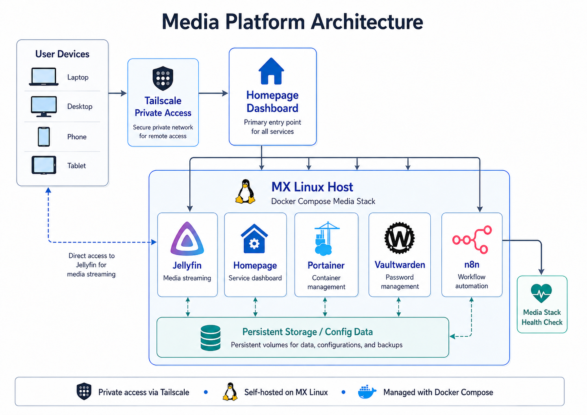
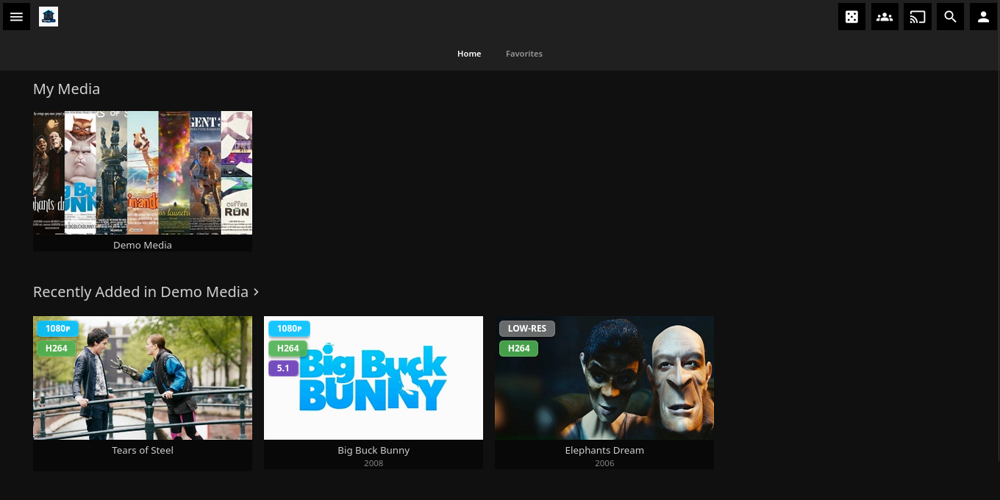
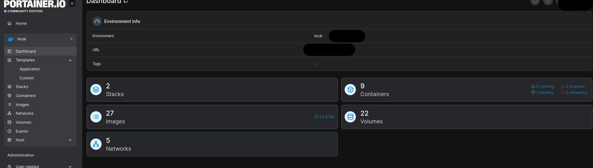
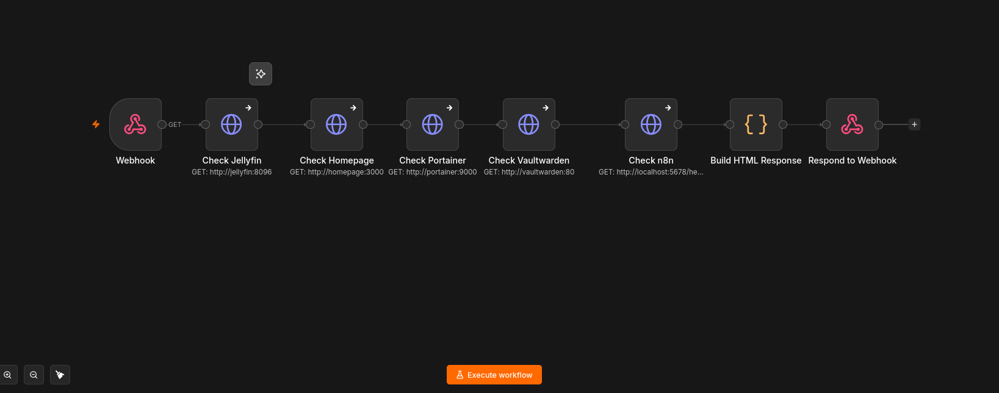
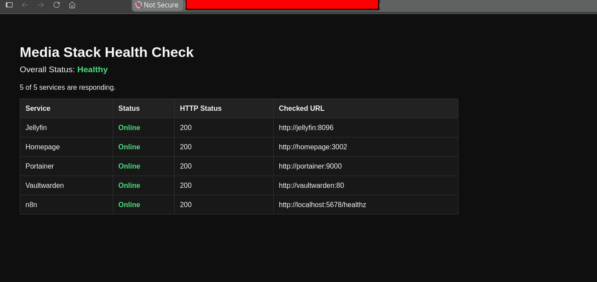

# Media Platform

The Media Platform is the primary self-hosted application stack in this homelab. It provides media streaming, service navigation, Docker management, password management, and automation using n8n and Docker Compose on the MX Linux host.

This stack is designed to be lightweight enough to run on older hardware while still demonstrating practical infrastructure skills such as container deployment, persistent storage, service organization, dashboard customization, private remote access, and workflow automation.

---

## Stack Overview



The Media Platform is organized as a Docker Compose stack running on the MX Linux host. Homepage acts as the main entry point, Tailscale provides private access from trusted devices, and each service runs in its own container with persistent storage for configuration and application data.

### Core Services

| Service | Purpose |
|---------|---------|
| Jellyfin | Self-hosted media server for streaming movies and shows |
| Homepage | Central dashboard for accessing homelab services |
| Portainer | Web-based Docker and container management |
| Vaultwarden | Self-hosted password manager compatible with Bitwarden clients |
| n8n | Workflow automation platform for custom service integrations |

---

## Purpose

The goal of the Media Platform is to create a functional self-hosted environment that can be used daily while also building hands-on experience with Linux and Docker-based infrastructure.

This stack demonstrates:

- Docker Compose service deployment
- Container networking
- Persistent application storage
- Web-based service management
- Dashboard organization
- Tailscale-based private access
- n8n workflow automation
- Self-hosted application administration
- Troubleshooting containerized services

---

## Service Breakdown

## Jellyfin



Jellyfin is the main media server in this stack. It is used to host and stream local media from the server to other devices.

### Role in the Stack

Jellyfin provides the primary user-facing media service. It organizes media libraries, stores metadata, and allows movies and shows to be streamed through a web browser or compatible client applications.

### Skills Practiced

- Hosting a self-managed media server
- Managing media libraries
- Configuring persistent storage
- Troubleshooting container access
- Understanding service ports and network access
- Managing application data outside the container lifecycle

---

## Homepage


Homepage is used as the central dashboard for the homelab. It organizes services into categories and provides a simple landing page for accessing the environment.

### Role in the Stack

Homepage acts as the main access point for the Media Platform. Instead of manually remembering IP addresses, ports, or service URLs, services are organized in one dashboard.

The dashboard includes links to:

- Jellyfin
- Portainer
- Vaultwarden
- n8n
- Monitoring services
- GitHub documentation
- External resources

The service links are configured around Tailscale access, allowing trusted devices to reach the hosted services without exposing them directly to the public internet.

### Skills Practiced

- Dashboard customization
- YAML configuration
- Service organization
- Internal documentation through UI design
- Improving usability of self-hosted services
- Organizing private access links through Tailscale

---

## Portainer



Portainer provides a web interface for managing Docker containers, images, volumes, networks, and Compose stacks.

### Role in the Stack

Portainer is used to visually manage the Docker environment and quickly check the state of containers without relying only on the command line.

### Common Uses

- Viewing running containers
- Checking logs
- Restarting containers
- Reviewing Docker networks
- Managing volumes
- Viewing deployed stacks
- Troubleshooting service issues

### Skills Practiced

- Docker container management
- Stack-based service organization
- Container log review
- Basic operational troubleshooting

---

## Vaultwarden

Vaultwarden is a lightweight self-hosted password manager compatible with Bitwarden clients.

### Role in the Stack

Vaultwarden is used to manage credentials for homelab services and other accounts in a centralized password vault.

Because it stores sensitive information, it is treated as one of the more security-sensitive services in the environment.

### Security Considerations

- Uses persistent storage for vault data
- Requires strong administrator credentials
- Should not be exposed publicly without proper HTTPS and access controls
- Needs reliable backups if used long term
- Should be monitored carefully after updates or configuration changes

### Skills Practiced

- Hosting a sensitive self-hosted application
- Managing persistent application data
- Understanding the importance of backups
- Applying basic access control practices

---

## n8n



n8n is the automation platform for the Media Platform stack. It is used to create workflows that connect services together and automate basic tasks.

### Role in the Stack

n8n allows the homelab to move beyond manually managed services by adding event-based and dashboard-triggered workflows.

In this stack, n8n is used for media-related automations and service checks.

### Skills Practiced

- Webhook-based automation
- HTTP request workflows
- Service availability checks
- Dashboard-triggered actions
- Basic service integration
- Formatting structured automation output

---

## Automation: Media Stack Health Check



The Media Stack Health Check is an n8n workflow that checks the availability of the core media services. It is triggered through a webhook and returns a simple browser-based status page showing whether each service is responding.

### Workflow Goal

The goal of this automation is to provide a quick on-demand health check for the Media Platform without manually opening every service one at a time.

### Workflow Design

```text
Homepage Button / Webhook URL
      |
      v
n8n Webhook Trigger
      |
      v
HTTP Request Nodes
      |
      v
Build HTML Response
      |
      v
Respond to Webhook
```

### Services Checked

| Service     | Check Type              |
| ----------- | ----------------------- |
| Jellyfin    | HTTP availability check |
| Homepage    | HTTP availability check |
| Portainer   | HTTP availability check |
| Vaultwarden | HTTP availability check |
| n8n         | Health endpoint check   |

### Implementation Details
The workflow uses separate HTTP Request nodes to check each service. Each request is configured to continue even if a service does not respond, allowing the workflow to return a complete status report instead of failing at the first unavailable service.

A Code node formats the results into an HTML response, and a Respond to Webhook node returns the final status page to the browser.

### Example Result
Media Stack Health Check

Jellyfin: Online
Homepage: Online
Portainer: Online
Vaultwarden: Online
n8n: Online

### Why This Automation Matters

Although the workflow is simple, it demonstrates several important infrastructure concepts:

Webhook-based automation
Service availability checks
HTTP request workflows
Dashboard-triggered operations
Basic health reporting
Integration between self-hosted tools
Using automation to simplify routine administration

This creates a practical automation that is directly tied to the services running in the homelab.

## Docker Compose Design

The Media Platform is deployed using Docker Compose. Each service runs in its own container while remaining part of the same overall stack.

Docker Compose is used because it makes the environment easier to manage, rebuild, and document.

### Benefits
- Services are isolated in separate containers
- Configuration is stored in a repeatable Compose file
- Containers can be restarted or recreated individually
- Persistent data can be mapped to host directories or Docker volumes
- The stack can be expanded over time
- Service configuration can be tracked and documented

## Persistent Storage

Persistent storage is important because containers are temporary by design. Application data must survive container restarts, updates, and rebuilds.

### Persistent Data Examples

| Service     | Persistent Data                                  |
| ----------- | ------------------------------------------------ |
| Jellyfin    | Media library settings, metadata, users, plugins |
| Homepage    | Dashboard configuration files                    |
| Portainer   | Stack and management configuration               |
| Vaultwarden | Password vault database and settings             |
| n8n         | Workflows, credentials, and automation history   |

Persistent storage helps ensure that the stack can be maintained without losing application configuration or user data.

## Network Access

The Media Platform is primarily accessed through Tailscale rather than relying only on local IP addresses and service ports.

Tailscale provides private access between trusted devices, allowing services on the MX Linux server to be reached without directly exposing them to the public internet.

### Access Model

| Access Type          | Description                                                                         |
| -------------------- | ----------------------------------------------------------------------------------- |
| Tailscale Access     | Primary method used to access Homepage and other services from trusted devices      |
| Local Network Access | Services can still be reached locally using the server IP address and service ports |
| Dashboard Access     | Homepage provides organized links to services using Tailscale-based addresses       |
| Management Access    | Portainer and SSH are used for server and container administration                  |
| Automation Access    | n8n workflows can be triggered through webhooks or dashboard buttons                |

### General Access Pattern

Most service links are organized through Homepage and configured to use Tailscale access.

https://tailscale-url:service-port

This keeps the platform convenient to access while avoiding unnecessary public exposure.

A deeper explanation of the Tailscale setup, remote access model, and security considerations will be documented separately in the security documentation.

## Security Notes

Basic security considerations for the Media Platform include:

- Use strong passwords for all administrative accounts
- Avoid exposing services directly to the public internet
- Use Tailscale for private remote access from trusted devices
- Keep Docker images updated
- Review container logs when troubleshooting
- Protect Vaultwarden carefully because it stores sensitive credentials
- Use persistent backups for important service data
- Limit unnecessary services and ports
- Document configuration changes before making major updates
- Redact webhook URLs, API keys, tokens, credentials, and secret values from screenshots and public documentation

## Troubleshooting Notes

Common troubleshooting areas for this stack include:

- Checking whether containers are running
- Reviewing container logs
- Verifying service ports
- Confirming volume paths are correct
- Restarting individual containers
- Checking Docker Compose syntax
- Confirming containers are on the correct Docker network
- Confirming the server is reachable through Tailscale
- Confirming the server is reachable on the local network

Useful commands:
```bash
docker ps
docker compose ps
docker compose logs
docker compose logs <service-name>
docker compose restart <service-name>
docker compose down
docker compose up -d
```
## Skills Demonstrated

This stack demonstrates practical experience with:

- Linux server administration
- Docker and Docker Compose
- Self-hosted application deployment
- Container networking
- Persistent storage planning
- Web dashboard customization
- Docker management with Portainer
- Password manager hosting
- Workflow automation with n8n
- Webhook troubleshooting
- Tailscale-based private access
- Infrastructure documentation

## Future Improvements

Planned improvements for the Media Platform include:

- Improve backup strategy for persistent volumes
- Add a reverse proxy for cleaner service URLs
- Continue improving dashboard layout and organization
- Expand automation workflows for service checks, media alerts, and maintenance tasks
