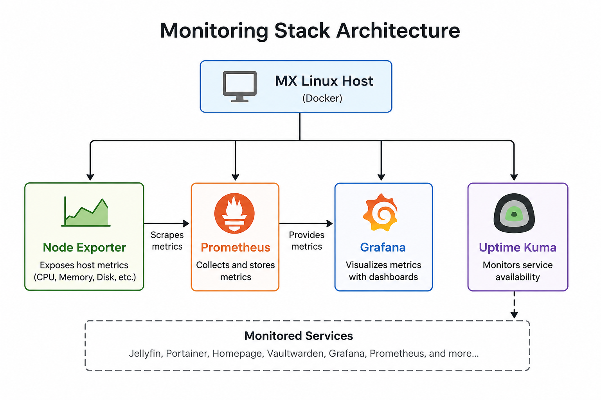
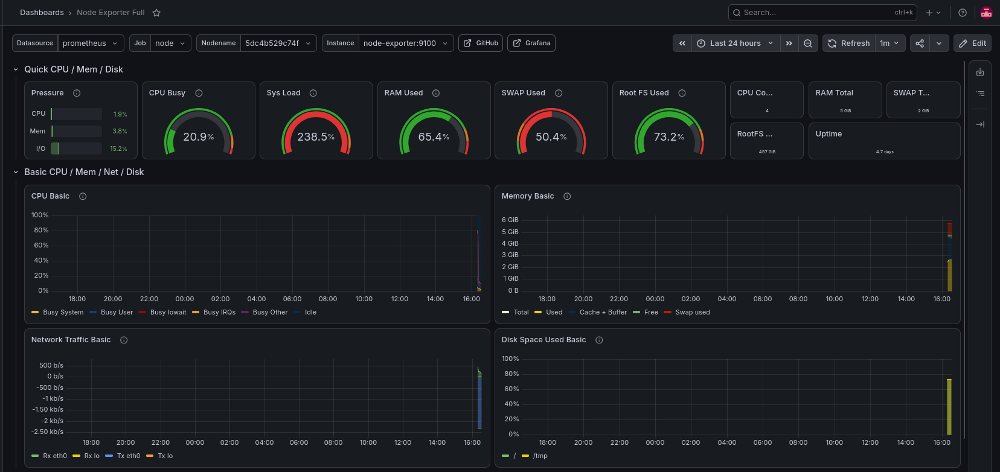
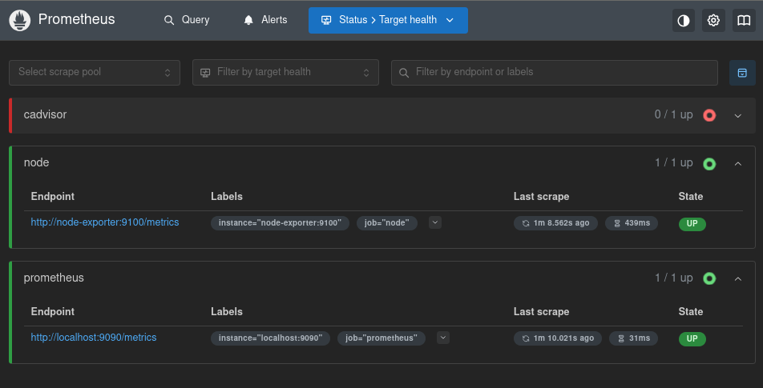
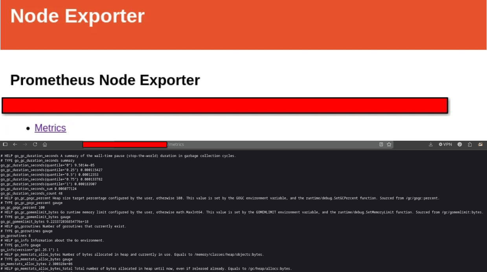
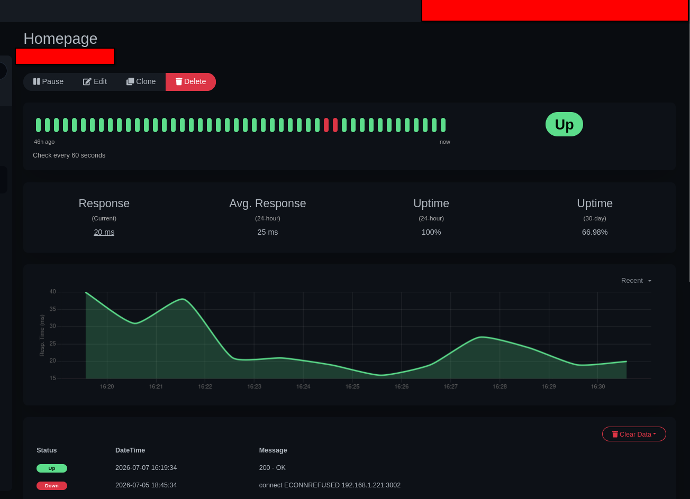

# Monitoring Stack

## Overview

The Monitoring Stack provides visibility into the health, performance, and availability of my self-hosted infrastructure. Rather than waiting for services to fail, this stack enables proactive monitoring through system metrics, service health checks, and customizable dashboards.

The stack is deployed using Docker Compose on my MX Linux host and consists of the following services:

- Grafana
- Prometheus
- Node Exporter
- Uptime Kuma

Together, these tools provide both infrastructure monitoring and service availability monitoring.

---

# Architecture

---

# Grafana

## Purpose

Grafana serves as the primary visualization platform for infrastructure metrics collected throughout the homelab.

Using dashboards, I can monitor:

- CPU utilization
- Memory usage
- Disk usage
- Filesystem utilization
- Network throughput
- System uptime
- Host performance trends

## Why I Implemented It

Rather than relying on command-line tools to troubleshoot performance issues, Grafana provides a centralized dashboard that makes it easy to identify trends and resource bottlenecks over time.

This allows me to quickly determine whether issues are caused by CPU, memory, storage, or networking.

## What I Learned

- Building dashboards from Prometheus metrics
- Organizing infrastructure metrics into meaningful visualizations
- Understanding resource utilization over time
- Monitoring Linux hosts through exported metrics

---

# Prometheus

## Purpose

Prometheus is responsible for collecting and storing time-series metrics from monitored systems.

It periodically scrapes metrics from exporters and makes them available for visualization within Grafana.

## Why I Implemented It

Prometheus provides the metrics backend for the monitoring platform.

Instead of manually collecting system statistics, Prometheus continuously gathers performance data that can be queried historically.

## What I Learned

- Prometheus scrape configuration
- Time-series metric collection
- Exporter-based monitoring
- PromQL fundamentals

---

# Node Exporter

## Purpose

Node Exporter exposes hardware and operating system metrics from the MX Linux host for Prometheus to collect.

Metrics include:

- CPU statistics
- Memory usage
- Disk utilization
- Filesystem statistics
- Network interfaces
- System load
- Hardware information

## Why I Implemented It

Node Exporter provides the low-level operating system metrics that power Grafana dashboards.

Without an exporter, Prometheus would have no visibility into the health of the Linux host itself.

## What I Learned

- Linux performance metrics
- Exporter architecture
- Prometheus metric collection
- Host monitoring best practices

---

# Uptime Kuma

## Purpose

Uptime Kuma continuously monitors the availability of services hosted within the homelab.

Current monitored services include:

- Jellyfin
- Jellyseerr
- Portainer
- Homepage
- Vaultwarden
- Grafana
- Prometheus
- Additional self-hosted services

## Why I Implemented It

While Grafana focuses on performance metrics, Uptime Kuma answers a different question:

> "Is the service actually available?"

This provides immediate visibility into service outages and verifies that Docker containers remain accessible.

## What I Learned

- HTTP health monitoring
- TCP service monitoring
- Status dashboards
- Service availability monitoring

---

# Key Skills Demonstrated

- Docker Compose deployment
- Infrastructure monitoring
- Linux system administration
- Metrics collection
- Performance visualization
- Dashboard creation
- Service availability monitoring
- Time-series databases
- Troubleshooting infrastructure performance

---

# Future Improvements

Planned enhancements include:

- Integrating Wazuh alerts into Grafana dashboards
- Monitoring additional virtual machine
- Adding alert notifications for service outages
- Long-term metric retention
- Custom dashboards for Docker containers
- Expanding infrastructure monitoring as the homelab grows

---

# Summary

This monitoring stack provides centralized visibility into both the health of the underlying infrastructure and the availability of hosted services.

Grafana, Prometheus, Node Exporter, and Uptime Kuma work together to provide real-time operational awareness, allowing issues to be identified and resolved before they impact the overall environment.
