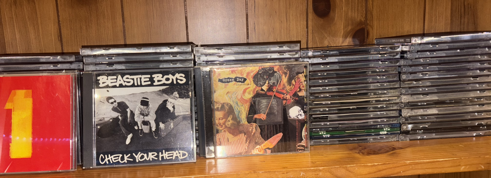
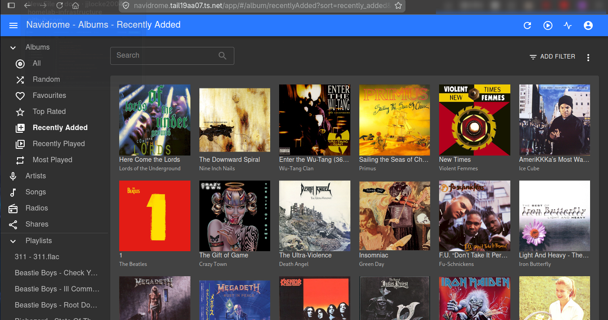

# Navidrome Music Server

## Overview

The Navidrome music server provides a lightweight, self-hosted platform for organizing and streaming a personal music collection.

The project began by digitizing an existing physical CD collection using the optical drive in the MX Linux homelab server. Albums were ripped to a lossless format, organized with consistent metadata, and then made available through Navidrome to approved devices.

This project combines physical-media preservation, Linux file management, metadata cleanup, Docker deployment, and private remote access.

## Goals

* Preserve a physical CD collection in a lossless digital format
* Organize albums and tracks consistently
* Host the library locally rather than relying entirely on commercial streaming platforms
* Access the collection from multiple devices
* Keep the service lightweight enough for older homelab hardware
* Maintain ownership and control of the original media files

## Core Technologies

| Technology                   | Purpose                                                       |
| ---------------------------- | ------------------------------------------------------------- |
| Navidrome                    | Web-based music server and streaming interface                |
| Docker Compose               | Container deployment and lifecycle management                 |
| Asunder                      | Audio CD ripping on Linux                                     |
| FLAC                         | Lossless audio storage format                                 |
| MusicBrainz Picard           | Metadata, album, artist, and cover-art management             |
| Tailscale                    | Private remote access                                         |
| Linux filesystem permissions | Controls access to configuration and media directories        |
| SSD storage                  | Stores application configuration and the active music library |

## Workflow

```text
Physical Audio CD
        |
   Asunder Ripping
        |
      FLAC Files
        |
 MusicBrainz Picard
 Metadata / Cover Art
        |
 Organized Album Folders
        |
     Navidrome
        |
 Local or Tailscale Client
```

## 1. Ripping the CDs

The server's built-in optical drive is used to read the physical discs.

Asunder was selected because it provides a simple Linux interface for:

* Reading audio CDs
* Looking up basic album information
* Selecting individual tracks
* Ripping directly to FLAC
* Preserving one folder per album
* Ejecting the disc automatically after completion

FLAC was chosen instead of a lossy format because it preserves the original audio quality and provides a long-term archival copy that can be converted later without reripping the disc.

*Below is a picture of the collection of production music CD's I found hidden in away in my home*



## 2. Library Organization

The music library is organized using a predictable folder structure:

```text
Music/
├── Artist Name/
│   └── Album Name/
│       ├── 01 - Track Name.flac
│       ├── 02 - Track Name.flac
│       └── cover.jpg
```

Consistent folder names make the collection easier to browse, back up, rescan, and move between applications.

## 3. Metadata and Album Artwork

MusicBrainz Picard is used after ripping to improve metadata quality.

Typical tasks include:

* Correcting artist and album names
* Assigning track numbers
* Matching releases against MusicBrainz
* Adding release dates and genres
* Embedding or saving album artwork
* Fixing inconsistent metadata that creates duplicate artists or albums

Automatic matching is reviewed before files are saved. Some compilations and custom discs require manual correction because multiple releases may contain similar track lists.

## 4. Navidrome Deployment



Navidrome runs as a Docker container in its own Compose stack.

The container uses two important persistent mounts:

```text
/config  -> Navidrome application data and database
/music   -> Music library
```

Keeping configuration and media outside the container ensures that:

* Container updates do not remove the library
* The service can be recreated from the Compose file
* Application data can be backed up separately
* Media permissions can be managed at the host level

The Navidrome configuration directory and active library are stored on SSD-backed storage for better responsiveness than the server's older mechanical drive.

## 5. Permissions

The Navidrome container must be able to read the music library and write to its configuration directory.

Permissions are managed using the Linux user and group IDs assigned to the container rather than granting unnecessarily broad access.

Common validation commands include:

```bash
ls -ld /path/to/navidrome/config
ls -ld /path/to/music
find /path/to/music -maxdepth 2 -type d | head
```

Incorrect permissions may cause the database to fail to open, the library to appear empty, or new files to remain unavailable after a scan.

## 6. Access

Navidrome is available to approved devices over the local network and through Tailscale.

Tailscale provides:

* Encrypted remote connectivity
* Access without exposing the service directly to the public Internet
* Consistent private addressing
* Support for web and compatible mobile clients

Navidrome can be accessed through its web interface or through Subsonic-compatible applications.

## 7. Resource-Aware Design

Navidrome was selected because it is lightweight compared with larger media platforms.

This is important because the homelab runs on older consumer hardware with limited memory and CPU capacity. Separating Navidrome into its own stack allows it to be started, stopped, updated, and troubleshot independently.

## 8. Challenges and Troubleshooting

### Database or Configuration Errors

Initial deployment issues may occur when the container cannot write to its configuration directory.

Resolution steps include:

* Confirming the bind-mount path exists
* Correcting ownership and permissions
* Verifying the expected container user and group IDs
* Restarting the stack after filesystem changes

### Missing Albums or Tracks

When files do not appear:

* Confirm the music directory is mounted correctly
* Check that Navidrome can read the files
* Trigger or wait for a library rescan
* Verify supported file extensions
* Review metadata for conflicting album or artist values

### Duplicate Albums or Artists

Duplicate entries are usually caused by inconsistent metadata rather than duplicated audio files.

MusicBrainz Picard is used to normalize:

* Album artist
* Track artist
* Album title
* Disc number
* Release identifiers
* Compilation status

### Damaged Discs

Some older discs contain scratches or read errors. These can cause slow ripping, repeated drive retries, incomplete tracks, or audible gaps.

Problem discs are cleaned carefully and retried. Severely damaged tracks may require another optical drive or a replacement disc.

## Current Status

| Component | Status |
| --------- | -------|
| Navidrome container | Operational |
| SSD-backed configuration | Operational |
| FLAC music library | Operational |
| Metadata cleanup with MusicBrainz Picard | Operational |
| Album artwork | Operational |
| Tailscale access | Operational |

The initial digitization effort produced a library of approximately 55+ albums and about 750+ tracks.

## Security and Privacy

* Navidrome is not intentionally exposed directly to the public Internet
* Remote access is provided through Tailscale
* Administrative credentials are excluded from the public repository
* Compose examples use placeholders instead of real secrets
* Configuration data is included in the encrypted backup workflow
* Media files remain under the user's control on local storage

## Backup Strategy

Backups prioritize:

* Docker Compose files
* Navidrome configuration
* Application database
* Metadata-related settings
* Documentation

The FLAC library can be backed up separately when storage capacity permits. Because the files originate from owned physical media, they can also be recreated by reripping the discs if necessary.

## Skills Demonstrated

* Linux audio-CD ripping
* Lossless media preservation
* Music metadata management
* Docker Compose deployment
* Persistent container storage
* Linux ownership and permissions
* Private remote access with Tailscale
* Resource-aware service selection
* Troubleshooting container mounts and databases
* Technical documentation
