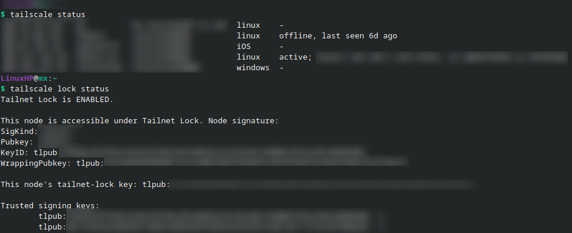
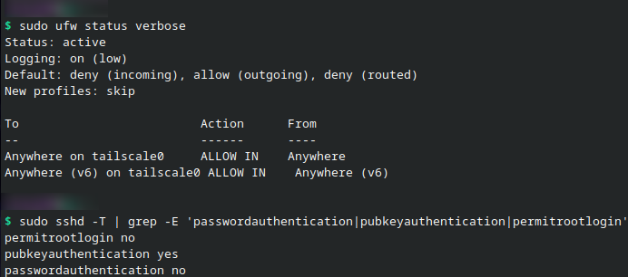
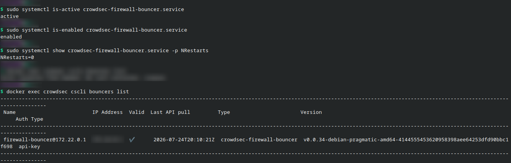
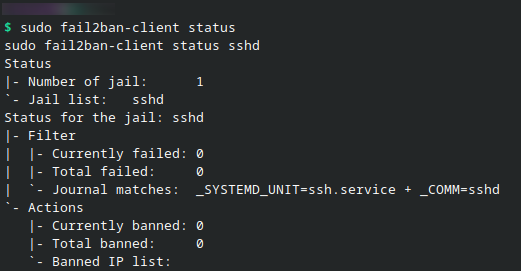

# Homelab Security and Hardening

## Overview

The homelab uses a layered security model designed for a small self-hosted Linux environment. The goal is to reduce unnecessary exposure, protect administrative access, limit access to internal services, and maintain recoverable copies of important configuration data.

The public documentation focuses on legitimate self-hosted services such as Jellyfin, Navidrome, Nextcloud, Portainer, n8n, Homepage, and the monitoring stack. Sensitive credentials and private configuration values are excluded from the repository.

## Security Controls Summary

| Control | Implementation | Purpose |
|---|---|---|
| Private remote access | Tailscale | Provides encrypted access without broadly exposing services to the public Internet |
| Device authorization | Tailnet Lock | Requires trusted devices to authorize new tailnet nodes |
| SSH authentication | Public-key authentication | Prevents password-based SSH logins |
| Host firewall | UFW with a default-deny inbound policy | Blocks unsolicited inbound traffic unless explicitly allowed |
| Threat detection | CrowdSec | Detects suspicious behavior using host and service logs |
| Automated enforcement | CrowdSec firewall bouncer | Applies blocking decisions at the firewall layer |
| Brute-force protection | Fail2Ban | Detects repeated authentication failures and bans sources |
| Backup encryption | LUKS-encrypted removable storage | Protects configuration backups at rest |
| Backup automation | rsync | Copies important configurations and Compose files |
| Secret handling | Private `.env` files and sanitized examples | Prevents credentials from being committed publicly |
| Workload separation | Independent Docker Compose stacks | Simplifies updates, troubleshooting, and recovery |

## 1. Private Remote Access with Tailscale

Tailscale is the primary remote-access layer for the homelab. It creates an encrypted private network between approved devices and removes the need to expose most administrative services through public router port forwarding.

Tailscale is used to access services such as:

- SSH
- Homepage
- Portainer
- Nextcloud
- Grafana and other monitoring tools
- Jellyfin
- Navidrome
- n8n

### Security Benefits

- Administrative services are not broadly exposed to the Internet
- Remote connections are encrypted
- Devices receive stable private addresses and names
- Lost or untrusted devices can be removed centrally
- Access can be limited to approved users and devices

## 2. Tailnet Lock

Tailnet Lock is enabled to strengthen device enrollment.

A device joining the Tailscale account must also be authorized by an existing trusted signing device before it can participate fully in the tailnet. This reduces the risk of an unauthorized node being added after an account compromise or accidental approval.

Signing capability is limited to selected trusted personal devices.



## 3. SSH Hardening

Administrative access to the MX Linux server uses SSH public-key authentication.

Implemented controls include:

- Password authentication disabled
- Public-key authentication required
- SSH access performed through the private Tailscale network
- Routine administration performed through a normal user account
- Privileged commands executed with `sudo`
- SSH keys stored only on trusted devices

This reduces exposure to password guessing, reused credentials, and automated Internet scanning.

## 4. UFW Host Firewall

UFW is configured with a default-deny inbound policy.

Only explicitly required traffic is permitted. Administrative access is restricted to the private Tailscale path, while local-network access is allowed only where needed for normal service use.



### Firewall Goals

- Deny unsolicited inbound connections
- Reduce exposure of management interfaces
- Permit only required local or Tailscale traffic
- Keep firewall rules understandable and auditable
- Provide protection even if an application is misconfigured

## 5. CrowdSec and Firewall Bouncer

CrowdSec analyzes authentication and service logs for behavior associated with scanning, brute-force attempts, and other suspicious activity.

The CrowdSec firewall bouncer applies blocking decisions at the host firewall layer. This allows detections to become active protections instead of remaining log-only events.

CrowdSec provides:

- Log-based behavior analysis
- Reusable detection scenarios
- Automated remediation decisions
- Firewall-level enforcement
- Visibility into active and historical blocks

UFW defines the normal access policy, while CrowdSec reacts dynamically to suspicious behavior.



## 6. Fail2Ban

Fail2Ban monitors authentication logs and temporarily bans sources that repeatedly fail authentication.

It is used as an additional layer of protection for SSH and other services that generate clear authentication-failure events.

Fail2Ban and CrowdSec provide overlapping but complementary controls:

- Fail2Ban supplies straightforward local jail-based protection
- CrowdSec adds broader behavior analysis
- UFW remains the static firewall policy underneath both



## 7. Secret and Credential Handling

Sensitive values are kept outside the public GitHub repository.

Examples include:

- Docker `.env` files
- Database passwords
- API keys
- Application administrator passwords
- Tailscale information
- Private hostnames and internal identifiers where appropriate

The public repository contains only:

- Sanitized Compose examples
- Placeholder environment files
- Architecture documentation
- Screenshots with sensitive values removed
- General configuration explanations

A `.gitignore` file is used to prevent private environment files and other sensitive data from being committed accidentally.

## 8. Encrypted Backups

Important configuration data is backed up with `rsync` to LUKS-encrypted removable storage.

The backup scope prioritizes files required to rebuild the environment:

- Docker Compose files
- Private environment files
- Container configuration directories
- Service settings
- Automation workflows
- Supporting documentation

Large, replaceable media files are excluded so limited backup capacity can be focused on configuration and personal documents.

### Security and Recovery Value

- LUKS protects backup data if the removable device is lost
- Configuration backups reduce recovery time after disk or host failure
- Compose files allow services to be recreated consistently
- Selective backups keep the process practical on limited hardware

## 9. Modular Docker Compose Stacks

Services are divided into independent Compose stacks, including media, monitoring, documentation, management, and automation workloads.

This improves both operations and security:

- Unrelated services do not need to be changed together
- A single stack can be stopped without taking down the entire server
- Troubleshooting scope is smaller
- Updates can be performed incrementally
- Secrets and configuration files remain easier to organize
- Recovery can be performed one workload at a time

Only required ports should be published to the host. Internal container communication should use Docker networks and service names where possible.

## 10. Service Access Model

```text
Trusted Laptop / Phone
          |
       Tailscale
          |
   UFW-Protected Host
          |
  +-------+--------+----------------+
  |                |                |
SSH / Admin    Docker Services   Monitoring
                   |
        Independent Compose Stacks
                   |
       Persistent Configuration
                   |
       Encrypted Backup Media
```

## Validation and Maintenance

The security controls require regular validation.

Recommended checks include:

- Confirm SSH password authentication remains disabled
- Review UFW rules after publishing a new Docker port
- Verify CrowdSec and its firewall bouncer are running
- Review Fail2Ban jail status and recent bans
- Confirm Tailscale devices are expected and authorized
- Remove unused tailnet devices
- Review Docker image updates before deployment
- Test backup readability and restoration procedures
- Confirm `.env` files and secrets remain excluded from Git
- Review Portainer and other administrative interfaces for unnecessary exposure

## Known Limitations

This is a home lab rather than a production enterprise environment.

Current limitations include:

- A single physical host creates a single point of failure
- Most services share the same underlying operating system
- Hardware constraints limit the number of security tools that can run simultaneously
- High availability is not implemented
- Backup capacity is focused on configuration and personal data rather than the full media library
- Some services require local-network access for normal household use

These limitations are documented so the project is represented accurately rather than overstated.

## Skills Demonstrated

- Linux host hardening
- SSH public-key administration
- Host firewall configuration
- Private networking with Tailscale
- Tailnet Lock authorization
- Intrusion-prevention tooling with CrowdSec and Fail2Ban
- Docker networking and workload separation
- Encrypted backup design
- Secret-management practices
- Layered security architecture
- Operational validation and recovery planning
